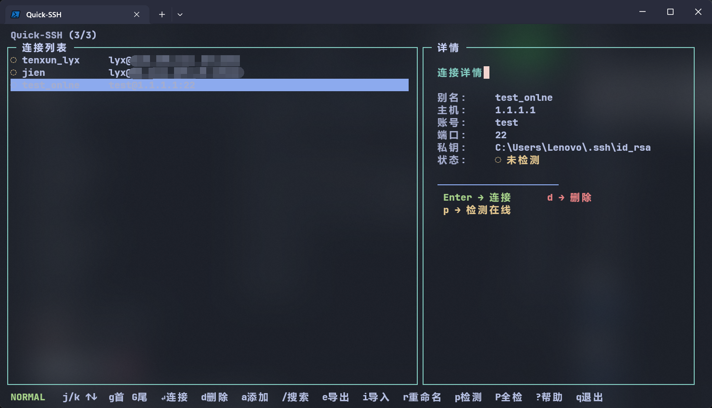

# Quick-SSH 🚀

> PowerShell SSH 连接管理工具


一键保存、管理、连接 SSH 服务器，告别记忆繁琐的 IP、端口和密钥路径。




---

## 功能特性 ✨

| 功能 | 说明 |
|------|------|
| 🔌 SSH 连接 | 一键连接已保存的 SSH 服务器 |
| 🖥️ TUI 终端界面 | 可视化键盘操作界面，类 `yazi` 操作体验 |
| ⌨️ Docker 风格 CLI | `ps`、`add`、`rm` 等子命令，上手即用 |
| 🏓 Ping 检测 | 列表中实时显示各主机连通状态（在线/离线） |
| 📦 npm 包管理 | 全局安装/卸载，自动配置 `$PROFILE` |
| 🔄 导入/导出 | JSON 格式批量导入导出主机配置 |
| ⏹ Tab 自动补全 | 子命令 + 已保存主机别名自动补全 |

---

## 安装前注意 ⚠️

Quick-SSH 依赖 PowerShell 执行策略运行脚本。安装前请先检查：

```powershell
Get-ExecutionPolicy
```

| 返回值 | 说明 | 操作 |
|--------|------|------|
| `RemoteSigned` 或 `Unrestricted` | ✅ 正常 | 直接安装即可 |
| `Restricted` | ❌ 无法运行脚本 | 需以管理员身份修改执行策略 |

**如果当前为 `Restricted`，请以管理员身份打开 PowerShell 并执行：**

```powershell
Set-ExecutionPolicy RemoteSigned -Scope CurrentUser
```

> 选择 `RemoteSigned` 表示仅信任来自互联网的脚本需要签名，本地脚本可直接运行，兼顾安全性与便利性。
>
> 如果希望更宽松（不推荐），可设为 `Unrestricted`。

修改完成后执行 `Get-ExecutionPolicy` 确认已生效，即可继续安装。

---

## 安装

### 方式一：npm 全局安装（推荐）

```powershell
npm install -g quick-ssh
```

安装完成后，**重启 PowerShell 终端**即可使用 `qssh` 命令。

> 安装脚本会自动将 `Import-Module` 写入你的 PowerShell 配置文件 (`$PROFILE`)，重启终端后永久生效。

如果希望在当前会话中立即加载（免重启），可执行 `qssh init` 后运行：

```powershell
& (Get-Content $PROFILE -Raw) | Invoke-Expression
```

### 方式二：手动加载

ps：我还没试过，有问题的话可以提issues

```powershell
# 下载本仓库，在 src\Quick-SSH.psm1 所在目录执行：
Import-Module .\src\Quick-SSH.psm1 -DisableNameChecking
```

---

## 快速入门

```powershell
# 直接输入qssh进入tui
qssh

# help
qssh help

# 添加一个 SSH 连接
qssh add my-server root@192.168.1.100:22 --key C:\Users\You\.ssh\id_rsa

# 一键连接
qssh my-server

# 列出所有连接
qssh ps

# 删除连接
qssh rm my-server
```

---

## 命令参考

### `qssh`

不带任何参数时启动 **TUI 终端界面**，通过键盘快捷键浏览和连接服务器。

| 快捷键 | 功能 |
|--------|------|
| <kbd>↑</kbd> / <kbd>↓</kbd> | 移动选择 |
| <kbd>Enter</kbd> | 连接选中主机 |
| <kbd>/</kbd> | 搜索 / 筛选 |
| <kbd>c</kbd> | Ping 连通性检测 |
| <kbd>d</kbd> | 删除选中主机 |
| <kbd>q</kbd> / <kbd>Esc</kbd> | 退出 TUI |
| <kbd>?</kbd> | 显示/隐藏帮助面板 |

### `qssh ps [关键词]`

列出所有已保存的 SSH 连接。

| 列 | 说明 |
|----|------|
| 别名 | 连接的自定义名称 |
| IP 地址 | 服务器主机名或 IP |
| 账号 | 登录用户名 |
| 端口 | SSH 端口（默认 22） |
| 私钥路径 | 认证私钥文件路径 |

**示例：**

```powershell
# 列出全部连接
qssh ps

# 筛选包含 "生产" 的连接
qssh ps 生产

# 无连接时的提示
# → 当前没有已保存的 SSH 连接。使用 'qssh add' 添加一个。
```

### `qssh add <别名> <用户名@IP:端口> [--key <私钥路径>]`

新增 SSH 连接记录（对应 `docker run` 的添加语义）。

**参数说明：**

| 参数 | 必填 | 默认值 | 说明 |
|------|------|--------|------|
| 别名 | ✅ | - | 连接的唯一标识名 |
| 用户名@IP:端口 | ✅ | - | `root@192.168.1.100` 或 `root@192.168.1.100:2222` |
| `--key` / `-k` | ❌ | `%USERPROFILE%\.ssh\id_rsa` | 私钥文件路径 |

**示例：**

```powershell
# 使用默认端口 22 和默认密钥
qssh add my-vm root@10.0.0.5

# 指定端口和密钥
qssh add prod-server deploy@192.168.1.100:2222 --key D:\keys\prod_id_rsa

# 支持 -k 简写
qssh add test-vm admin@172.16.0.10 -k C:\Users\Me\.ssh\test_rsa

# 别名重复会报错
# → 错误：别名 'my-vm' 已存在，请使用其他名称。
```

### `qssh rm <别名>`

删除指定别名的 SSH 主机配置（对应 `docker rm`）。

```powershell
qssh rm my-vm
# → ✔ 已删除 SSH 连接 'my-vm'。

qssh rm unknown
# → 错误：别名 'unknown' 不存在。使用 'qssh ps' 查看可用连接。
```

### `qssh <别名>`

一键连接 SSH 服务器。自动读取保存的 IP、账号、端口、私钥发起会话。

> 内置兼容老旧 `ssh-rsa` 密钥协商参数 `-o HostKeyAlgorithms=+ssh-rsa`，无需手动添加。

```powershell
qssh my-server
# → 正在连接到 'my-server' (root@192.168.1.100:22) ...
```

### `qssh init`

将 Quick-SSH 注册到当前 PowerShell 版本的 `$PROFILE` 中，实现开箱即用。

```powershell
qssh init
# → 检测到当前 $PROFILE 路径:
#   C:\Users\Lenovo\Documents\WindowsPowerShell\Microsoft.PowerShell_profile.ps1
# → ✔ 已写入 ...
# → ✔ 配置完成！请重启 PowerShell 终端使其生效。
```

> `$PROFILE` 自动指向当前运行的 PowerShell 版本：
> - **PowerShell 7** → `...\Documents\PowerShell\Microsoft.PowerShell_profile.ps1`
> - **Windows PowerShell 5.1** → `...\Documents\WindowsPowerShell\Microsoft.PowerShell_profile.ps1`
>
> 如果目录或文件不存在，`qssh init` 会自动创建。

### `qssh export <文件路径>`

将全部主机配置导出到指定 JSON 文件。

```powershell
qssh export D:\backup\ssh-hosts.json
# → ✔ 已导出 3 个连接到 'D:\backup\ssh-hosts.json'。
```

### `qssh import <文件路径>`

从外部 JSON 文件批量导入连接，自动跳过别名重复的记录。

```powershell
qssh import D:\backup\ssh-hosts.json
# → ✔ 导入完成：新增 5 个，跳过 2 个（别名重复）。
```

### `qssh help`

显示帮助信息。

---

## Tab 自动补全

输入 `qssh` 后按 <kbd>Tab</kbd> 键，可自动补全：

- **子命令**：`ps`、`add`、`rm`、`init`、`export`、`import`、`help`
- **已保存的主机别名**：快速选择要连接的服务器

---

## 配置文件

所有连接数据存储在以下位置，**不会在卸载时删除**：

```
%USERPROFILE%\.quickssh\hosts.json
```

示例配置文件内容：

```json
[
    {
        "alias": "my-server",
        "host": "192.168.1.100",
        "user": "root",
        "port": 22,
        "key": "C:\\Users\\You\\.ssh\\id_rsa"
    }
]
```

---

## 近期规划 🗓️

| 功能 | 说明 |
|------|------|
| 📂 SFTP 连接 | 基于 SSH 的文件传输，支持上传 / 下载 / 浏览 |
| 🔔 自动检测更新 | 启动时检查 npm 新版本并提示升级 |
| 📤 拖拽文件上传 | 在 TUI 界面中拖拽文件直接上传到服务器 |
| 🔄 批量执行 | 选中多台主机，批量发送同一命令 |
| 📋 一键保存 Log | 记录每次连接的时间戳与操作日志 |
| 🪟 新窗口打开 | 连接服务器时自动打开新终端窗口 |
| 🤖 AI 辅助指令 | 自然语言描述操作意图，AI 生成对应命令 |

---

## 卸载

```powershell
npm uninstall -g quick-ssh
```

卸载时：
- ✅ 自动从 `$PROFILE` 中移除 `Import-Module` 配置
- ✅ **保留** `%USERPROFILE%\.quickssh\hosts.json` 用户配置数据

---

## 项目文件结构

```
quick-ssh/
├── src/
│   ├── Quick-SSH.psm1          # 核心 PowerShell 模块
│   ├── lib/
│   │   └── index.js             # npm 生命周期钩子（安装/卸载自动配置）
│   └── tui/
│       ├── index.js             # TUI 主入口（Blessed 界面 + 键位绑定）
│       ├── modes.js             # 模式常量/标签/提示（易于扩展）
│       ├── data.js              # 数据层（配置读写）
│       └── network.js           # 网络层（SSH 连接 + 在线检测）
├── doc/
│   └── images/                  # 截图展示
├── package.json                 # npm 包配置
├── README.md                    # 本文档
├── LICENSE                      # MIT 许可证
└── .gitignore
```

---

## License

[MIT](LICENSE)
