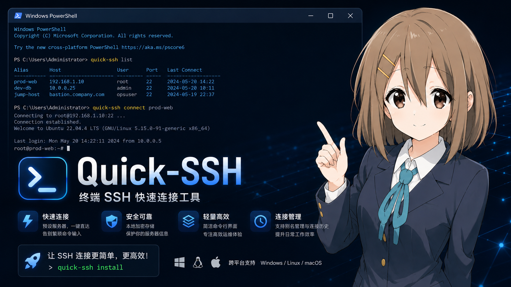

> 💡 **遇到问题？** 请查阅 [常见问题 (FAQ)](doc/FAQ.md)，其中收录了密钥权限、终端恢复、编码错误等常见问题的解决方案。

---

## 功能特性 ✨

| 功能 | 说明 |
|------|------|
| 🔌 SSH 连接 | 一键连接已保存的 SSH 服务器 |
| 🖥️ TUI 终端界面 | 可视化键盘操作界面，类 `yazi` 操作体验 |
| ⌨️ Docker 风格 CLI | `ps`、`add`、`rm` 等子命令，上手即用 |
| 🏓 Ping 检测 | 列表中实时显示各主机连通状态（在线/离线） |
| 📦 npm 包管理 | 全局安装/卸载，自动配置 `$PROFILE` / `~/.bashrc` / `~/.zshrc` |
| 🔄 导入/导出 | JSON 格式批量导入导出主机配置 |
| ⏹ Tab 自动补全 | 子命令 + 已保存主机别名自动补全 |
| 🌐 跨平台 | **Windows**（PowerShell 模块）+ **Linux/macOS**（Node.js CLI）双后端 |

---

## 跨平台支持

Quick-SSH 支持 **Windows / Linux / macOS** 三大主流操作系统。

### 架构概览

Quick-SSH 根据操作系统选择不同的后端：

```
                        npm install -g quick-ssh
                                │
                                ▼
                         detectOS()
                        ┌────┴────┐
                        │         │
                     Windows    Linux / macOS
                        │         │
                        ▼         ▼
                  PowerShell    Node.js CLI
                  模块 (.psm1)   (src/unix/cli.js)
                        │         │
                        ▼         ▼
                  PowerShell    ~/.bashrc
                  $PROFILE      ~/.zshrc
                  (Import-      (qssh() 函数
                   Module)      调用 node)

  Windows 运行时:  PowerShell → Import-Module → qssh 命令
  Linux 运行时:    bash/zsh → qssh() → node src/unix/cli.js → ssh
```

### 系统检测与配置注入

| 操作系统 | 检测机制 | 配置文件 | 注入内容 | 运行时后端 |
|----------|----------|----------|----------|------------|
| **Windows** | `process.platform === "win32"` | PowerShell `$PROFILE` (PS7 / WinPS 5.1) | `Import-Module` 语句 | PowerShell 模块 ([`src/win/Quick-SSH.psm1`](src/win/Quick-SSH.psm1)) |
| **Linux** | `process.platform === "linux"` | `~/.bashrc` / `~/.zshrc` / `~/.profile` (自动检测 `$SHELL`) | `qssh()` → `node src/unix/cli.js "$@"` | Node.js CLI ([`src/unix/cli.js`](src/unix/cli.js)) |
| **macOS** | `process.platform === "darwin"` | `~/.zshrc` / `~/.bashrc` (自动检测 `$SHELL`) | `qssh()` → `node src/unix/cli.js "$@"` | Node.js CLI ([`src/unix/cli.js`](src/unix/cli.js)) |

> **Linux/macOS 无 PowerShell 依赖**：`qssh` 命令通过 `node src/unix/cli.js` 直接运行，不需要安装 PowerShell Core。所有功能（添加/删除/列出/连接/导入/导出/TUI）均由 Node.js 原生实现。
>
> **💡 WSL 用户注意**：在 WSL 中，Quick-SSH 使用 **Node.js CLI 后端**（与原生 Linux 相同），而不是 Windows PowerShell 后端。请确保 WSL 中已安装 `node` 和 `npm`。如果你的 `~/.ssh/config` 是从 Windows 侧共享的（如通过 `/mnt/c/` 挂载的符号链接），密钥路径中的反斜线会被 Quick-SSH 自动归一化为正斜线。

### 核心模块

| 文件 | 作用 |
|------|------|
| [`src/lib/index.js`](src/lib/index.js) | `detectOS()` → Windows(注入 `$PROFILE`) / Linux/macOS(注入 `~/.bashrc`/`~/.zshrc`) |
| [`src/win/Quick-SSH.psm1`](src/win/Quick-SSH.psm1) | **Windows 后端** — PowerShell 模块，实现所有 `qssh` 命令 |
| [`src/unix/cli.js`](src/unix/cli.js) | **Linux/macOS 后端** — Node.js CLI，实现所有 `qssh` 命令（复用 `data.js` 数据层） |
| [`src/tui/data.js`](src/tui/data.js) | 共享数据层 — 读写 `~/.ssh/config`，路径归一化跨平台兼容 |
| [`src/tui/network.js`](src/tui/network.js) | `getSSHExe()` → `ssh.exe` (Windows) / `ssh` (Linux/macOS) |
| [`src/tui/index.js`](src/tui/index.js) | TUI 界面 — blessed 终端 UI，跨平台按键绑定 |


---

## 安装前注意 ⚠️

1. Quick-SSH 依赖 PowerShell 执行策略运行脚本。安装前请先检查：

```powershell
Get-ExecutionPolicy
```

| 返回值 | 说明 | 操作 |
|--------|------|------|
| `RemoteSigned` 或 `Unrestricted` | ✅ 正常 | 直接安装即可 |
| `Restricted` | ❌ 无法运行脚本 | 需以管理员身份修改执行策略 |

**如果当前为 `Restricted`，请以管理员身份打开 PowerShell 并执行：**

```powershell
Set-ExecutionPolicy RemoteSigned -Scope CurrentUser
```

> 选择 `RemoteSigned` 表示仅信任来自互联网的脚本需要签名，本地脚本可直接运行，兼顾安全性与便利性。
>
> 如果希望更宽松（不推荐），可设为 `Unrestricted`。

修改完成后执行 `Get-ExecutionPolicy` 确认已生效，即可继续安装。

2. `.ssh/`文件夹的权限记得开够~

---

## 安装

### 方式一：npm 全局安装（推荐）

```bash
npm install -g quick-ssh
```

安装脚本会自动检测你的操作系统并写入对应的配置文件：

| 操作系统 | 配置文件 | 注册方式 | 运行时后端 |
|----------|----------|----------|------------|
| **Windows** | PowerShell `$PROFILE` | `Import-Module` | PowerShell 模块 |
| **Linux** | `~/.bashrc` / `~/.zshrc` | `qssh()` 函数包装 | Node.js CLI |
| **macOS** | `~/.zshrc` / `~/.bashrc` | `qssh()` 函数包装 | Node.js CLI |

安装完成后：

- **Windows** → **重启 PowerShell 终端**，即可使用 `qssh` 命令
- **Linux/macOS** → 执行 `source ~/.bashrc`（或 `source ~/.zshrc`），即可使用 `qssh` 命令

> **对 Linux/macOS 用户**：Quick-SSH **不依赖 PowerShell**，所有功能通过 Node.js 原生实现。只需要系统已安装 `node`、`npm` 和 `ssh` 客户端即可。

如果希望在当前会话中立即加载（免重启）：

**Windows PowerShell：**
```powershell
& (Get-Content $PROFILE -Raw) | Invoke-Expression
```

**Linux/macOS bash/zsh：**
```bash
source ~/.bashrc
# 或
source ~/.zshrc
```

---

## 快速入门

```bash
# 直接输入 qssh 进入 TUI 界面
qssh

# 查看帮助
qssh help

# 添加一个 SSH 连接（Linux/macOS）
qssh add my-server root@192.168.1.100:22 --key ~/.ssh/id_rsa

# 添加一个 SSH 连接（Windows）
qssh add my-server root@192.168.1.100:22 --key C:\Users\You\.ssh\id_rsa

# 一键连接
qssh my-server

# 列出所有连接
qssh ps

# 删除连接
qssh rm my-server
```

---

## 命令参考

### `qssh`

不带任何参数时启动 **TUI 终端界面**，通过键盘快捷键浏览和连接服务器。

| 快捷键 | 功能 |
|--------|------|
| <kbd>↑</kbd> / <kbd>↓</kbd> | 移动选择 |
| <kbd>Enter</kbd> | 连接选中主机 |
| <kbd>/</kbd> | 搜索 / 筛选 |
| <kbd>c</kbd> | Ping 连通性检测 |
| <kbd>d</kbd> | 删除选中主机 |
| <kbd>q</kbd> / <kbd>Esc</kbd> | 退出 TUI |
| <kbd>?</kbd> | 显示/隐藏帮助面板 |

### `qssh ps [关键词]`

列出所有已保存的 SSH 连接。

| 列 | 说明 |
|----|------|
| 别名 | 连接的自定义名称 |
| IP 地址 | 服务器主机名或 IP |
| 账号 | 登录用户名 |
| 端口 | SSH 端口（默认 22） |
| 私钥路径 | 认证私钥文件路径 |

**示例：**

```bash
# 列出全部连接
qssh ps

# 筛选包含 "生产" 的连接
qssh ps 生产

# 无连接时的提示
# → 当前没有已保存的 SSH 连接。使用 'qssh add' 添加一个。
```

### `qssh add <别名> <用户名@IP:端口> [--key <私钥路径>]`

新增 SSH 连接记录（对应 `docker run` 的添加语义）。

**参数说明：**

| 参数 | 必填 | 默认值 | 说明 |
|------|------|--------|------|
| 别名 | ✅ | - | 连接的唯一标识名 |
| 用户名@IP:端口 | ✅ | - | `root@192.168.1.100` 或 `root@192.168.1.100:2222` |
| `--key` / `-k` | ❌ | `~/.ssh/id_rsa` (Linux/macOS) / `%USERPROFILE%\.ssh\id_rsa` (Windows) | 私钥文件路径 |

**示例：**

```bash
# 使用默认端口 22 和默认密钥
qssh add my-vm root@10.0.0.5

# 指定端口和密钥（Linux/macOS 使用正斜线 ~/ 路径）
qssh add prod-server deploy@192.168.1.100:2222 --key ~/.ssh/prod_rsa

# 指定端口和密钥（Windows 使用反斜线路径）
qssh add prod-server deploy@192.168.1.100:2222 --key D:\keys\prod_id_rsa

# 支持 -k 简写
qssh add test-vm admin@172.16.0.10 -k ~/.ssh/test_rsa

# 别名重复会报错
# → 错误：别名 'my-vm' 已存在，请使用其他名称。
```

### `qssh rm <别名>`

删除指定别名的 SSH 主机配置（对应 `docker rm`）。

```bash
qssh rm my-vm
# → ✔ 已删除 SSH 连接 'my-vm'。

qssh rm unknown
# → 错误：别名 'unknown' 不存在。使用 'qssh ps' 查看可用连接。
```

### `qssh <别名>`

一键连接 SSH 服务器。自动读取保存的 IP、账号、端口、私钥发起会话。

> 内置兼容老旧 `ssh-rsa` 密钥协商参数 `-o HostKeyAlgorithms=+ssh-rsa`，无需手动添加。

```bash
qssh my-server
# → 正在连接到 'my-server' (root@192.168.1.100:22) ...
```

### `qssh init`

重新将 Quick-SSH 注册到当前 Shell 的配置文件中。

- **Windows**: 写入 PowerShell `$PROFILE`
- **Linux/macOS**: 写入 `~/.bashrc` / `~/.zshrc`

```bash
qssh init
# Windows:
# → ✔ 已写入 C:\Users\Lenovo\Documents\PowerShell\Microsoft.PowerShell_profile.ps1
# Linux:
# → ✔ 已写入 ~/.bashrc
#
# → ✔ 配置完成！请重启终端或执行 source 使其生效。
```

> **提示**：`npm install -g` 安装时已自动执行 `postinstall` 脚本完成配置注入。`qssh init` 在需要重新注册或手动修复时使用。

### `qssh export <文件路径>`

将全部主机配置导出到指定 JSON 文件。

```bash
# Windows
qssh export D:\backup\ssh-hosts.json

# Linux/macOS
qssh export ~/backup/ssh-hosts.json

# → ✔ 已导出 3 个连接到 '...'。
```

### `qssh import <文件路径>`

从外部 JSON 文件批量导入连接，自动跳过别名重复的记录。

```bash
# Windows
qssh import D:\backup\ssh-hosts.json

# Linux/macOS
qssh import ~/backup/ssh-hosts.json

# → ✔ 导入完成：新增 5 个，跳过 2 个（别名重复）。
```

### `qssh help`

显示帮助信息。

---

## Tab 自动补全

输入 `qssh` 后按 <kbd>Tab</kbd> 键，可自动补全：

- **子命令**：`ps`、`add`、`rm`、`init`、`export`、`import`、`help`
- **已保存的主机别名**：快速选择要连接的服务器

---

## 配置文件

Quick-SSH 使用 **标准 OpenSSH 配置文件** (`~/.ssh/config`) 存储所有连接数据，**Win/Linux/macOS 完全统一**，不会在卸载时删除。

```
~/.ssh/config
```

你可以直接用文本编辑器编辑该文件，也可以使用 `qssh` 命令管理。以下是 Quick-SSH 管理的 Host 块示例：

```
Host my-server
    HostName 192.168.1.100
    User root
    Port 22
    IdentityFile ~/.ssh/id_rsa
```

> 除了 Quick-SSH 管理的 Host 块外，`~/.ssh/config` 中还可以包含全局选项、注释、以及其他 SSH 客户端（如原生 `ssh` 命令）使用的配置，Quick-SSH 会保留所有非自己管理的内容。

---

## 近期规划 🗓️

| 功能 | 说明 |
|------|------|
| 📂 SFTP 连接 | 基于 SSH 的文件传输，支持上传 / 下载 / 浏览 |
| 🔔 自动检测更新 | 启动时检查 npm 新版本并提示升级 |
| 📤 拖拽文件上传 | 在 TUI 界面中拖拽文件直接上传到服务器 |
| 🔄 批量执行 | 选中多台主机，批量发送同一命令 |
| 📋 一键保存 Log | 记录每次连接的时间戳与操作日志 |
| 🪟 新窗口打开 | 连接服务器时自动打开新终端窗口 |
| 🤖 AI 辅助指令 | 自然语言描述操作意图，AI 生成对应命令 |

---

## 卸载

```bash
npm uninstall -g quick-ssh
```

卸载时：
- ✅ **Windows**: 自动从 PowerShell `$PROFILE` 中移除 `Import-Module` 配置
- ✅ **Linux/macOS**: 自动从 `~/.bashrc` / `~/.zshrc` 等文件中移除 `qssh()` 包装函数
- ✅ **保留** `~/.ssh/config` 用户配置数据（不会在卸载时删除）

---

## 项目文件结构

```
quick-ssh/
├── src/
│   ├── win/
│   │   └── Quick-SSH.psm1      # PowerShell 模块（Windows 后端）
│   ├── unix/
│   │   ├── cli.js              # Node.js CLI（Linux/macOS 后端）
│   │   └── install.sh          # Shell 配置文件注入脚本
│   ├── lib/
│   │   └── index.js            # npm 生命周期钩子（安装/卸载自动配置）
│   └── tui/
│       ├── index.js            # TUI 主入口（Blessed 界面 + 键位绑定）
│       ├── modes.js            # 模式常量/标签/提示（易于扩展）
│       ├── data.js             # 数据层（配置读写，CLI 和 TUI 共用）
│       └── network.js          # 网络层（SSH 连接 + 在线检测）
├── doc/
│   ├── FAQ.md                   # 常见问题解答
│   └── images/                  # 截图展示
├── package.json                 # npm 包配置
├── README.md                    # 本文档
├── LICENSE                      # MIT 许可证
└── .gitignore
```
---


<details>
<summary>☕ Support Quick-SSH</summary>

<br>

如果 Quick-SSH 帮你节省了时间，欢迎请开发者喝杯咖啡 ☕

<table>
<tr>
<td align="center">
<b>微信支付</b><br>

</td>

<td align="center">
<b>支付宝</b><br>

</td>
</tr>
</table>

感谢每一位支持 Quick-SSH 的朋友 ❤️

</details>


---

## License

[MIT](LICENSE)
