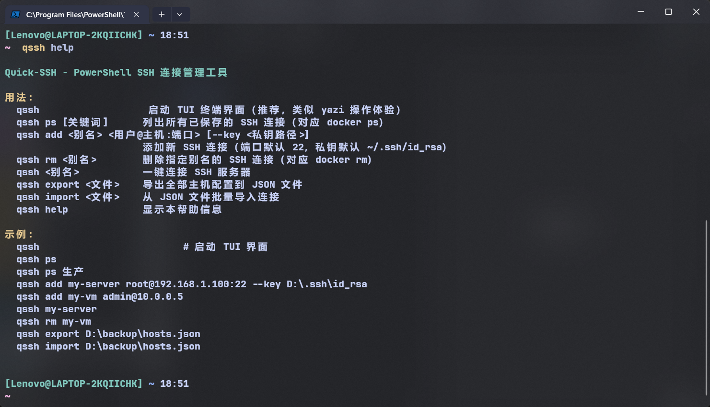
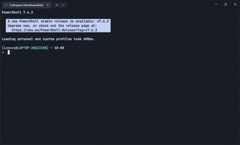

**Quick-SSH** — 跨平台 SSH 连接管理器，提供 TUI 界面与 Docker 风格 CLI。

基于 Rust 实现，**无需 Node.js 运行时**，即下即用。

---
## 使用示例







---

---

## 安装指南

### 📦 使用系统包管理器

| 平台 | 包管理器 | 状态 | 命令 |
|------|---------|------|------|
| **Windows** | **Scoop** | ✅ 已就绪 | `scoop bucket add cceli https://github.com/CCE-Li/scoop-bucket && scoop install quick-ssh` |
| **Windows** | **WinGet** | ✅ 已就绪 | `winget install CCE-Li.Quick-SSH` |
| **macOS** | **Homebrew** | ✅ 已就绪 | `brew tap CCE-Li/quick-ssh && brew install quick-ssh`（自建 Tap） |
| **Arch Linux** | **AUR (pacman)** | ✅ 已就绪 | `yay -S quick-ssh` |
| **Debian/Ubuntu** | **APT (.deb)** | ✅ 已就绪 | 从 [Release](https://github.com/CCE-Li/Quick-SSH/releases) 下载 `.deb`，执行 `sudo dpkg -i quick-ssh_*.deb` |

> **包管理器工作原理**：以上所有包管理器都引用了 GitHub Release 上的预编译二进制文件。
> 每次发布新版本后，运行 `.\scripts\update-packaging.ps1` 即可自动更新所有配置。

### 📥 直接下载

从 [GitHub Releases](https://github.com/CCE-Li/Quick-SSH/releases) 下载对应平台的归档文件：

```bash
# Linux / macOS — 下载 .tar.gz 并解压
tar xzf qssh-x86_64-linux.tar.gz
sudo cp qssh/qssh /usr/local/bin/
sudo cp qssh/qssh-uploader /usr/local/bin/

# Windows — 下载 .zip 并解压，将 qssh.exe 所在目录加入 PATH
```

### 🔧 从源码编译（cargo）

```bash
# 需要 Rust 工具链: https://rustup.rs
git clone https://github.com/CCE-Li/Quick-SSH.git
cd Quick-SSH
cargo build --release
# 二进制位于: target/release/qssh.exe (或 qssh)
```

---

## 5 分钟上手

### 启动 TUI

```bash
qssh
```

TUI 默认读取 `~/.ssh/config`。常用键位：

| 按键 | 功能 |
|------|------|
| `↑` / `↓` | 选择主机 |
| `Enter` | 连接选中主机 |
| `/` | 搜索 |
| `Space` | 标记/取消标记 |
| `d` | 删除选中 |
| `p` | Ping 检测 |
| `q` / `Esc` | 退出 / 取消搜索 |
| `?` | 帮助 |

### CLI 命令

```bash
qssh add mysrv root@192.168.1.100       # 添加主机
qssh add mysrv root@10.0.0.1 -k ~/.ssh/id_rsa  # 指定密钥
qssh ps                                  # 列出所有主机
qssh ps dev                              # 搜索含"dev"的主机
qssh mysrv                               # 一键连接
qssh rm mysrv                            # 删除主机
qssh export                              # 导出为 JSON
qssh import backup.json                  # 从 JSON 导入
```

### 文件上传

SSH 连接后，将本地文件或目录**拖入终端窗口**，Quick-SSH 会自动在新窗口中启动 SFTP 上传，显示每文件的进度条和总进度。

也可使用独立上传工具：

```bash
qssh-uploader mysrv ./myfile.zip /remote/path/
```

---

## 配置

所有连接数据保存在 **`~/.ssh/config`**（标准 OpenSSH 格式），Quick-SSH 会保留文件中所有非自己管理的内容。

程序行为可通过 **`~/.qsshrc** 配置：

```ini
UploadConcurrency=3
```

---

## 文档

| 文档 | 说明 |
|------|------|
| [`docx/architecture.md`](docx/architecture.md) | Rust 架构设计 |
| [`docx/release.md`](docx/release.md) | 发布流程与包管理器维护 |
| [`docx/roadmap.md`](docx/roadmap.md) | 开发路线图 |

---

## License

[MIT](LICENSE)