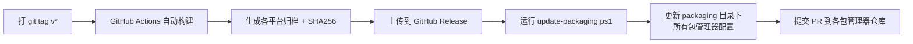

# 🚀 发布流程

## 概述

Quick-SSH 使用 **GitHub Actions** 自动构建跨平台二进制并发布到 GitHub Release。
发布后使用 [`scripts/update-packaging.ps1`](../scripts/update-packaging.ps1) 一键更新所有包管理器配置。



---

## 完整发布流程

### 步骤 1: 更新版本号

```bash
# 修改 Cargo.toml 中的 workspace version
# 例如: version = "2.0.1" → version = "2.1.0"
```

### 步骤 2: 提交并打标签

```bash
git add .
git commit -m "chore: bump version to v2.1.0"
git tag v2.1.0
git push && git push --tags
```

### 步骤 3: GitHub Actions 自动构建

推送 `v*` 标签后，[`release.yml`](../.github/workflows/release.yml) 会自动：

| 平台 | 归档格式 | 产物 |
|------|---------|------|
| Linux x86_64 | `.tar.gz` | `qssh-x86_64-linux.tar.gz` |
| macOS x86_64 | `.tar.gz` | `qssh-x86_64-macos.tar.gz` |
| macOS ARM64 | `.tar.gz` | `qssh-aarch64-macos.tar.gz` |
| Windows x86_64 | `.zip` | `qssh-x86_64-windows.zip` |

每个归档包含：
- `qssh` / `qssh.exe` — 主程序
- `qssh-uploader` / `qssh-uploader.exe` — 文件上传工具
- `LICENSE` — MIT 许可证
- `README.md` — 说明文档
- `qssh.bash` / `qssh.zsh` / `qssh.fish` / `qssh.ps1` — Shell 补全

### 步骤 4: 更新包管理器配置（一键自动化）

```powershell
# 从 GitHub Release 下载归档 → 计算 SHA256 → 更新所有配置文件
.\scripts\update-packaging.ps1
```

此脚本自动更新：
| 配置文件 | 更新内容 |
|---------|---------|
| [`packaging/scoop/quick-ssh.json`](../packaging/scoop/quick-ssh.json) | 版本号 + SHA256 |
| [`packaging/homebrew/quick-ssh.rb`](../packaging/homebrew/quick-ssh.rb) | 版本号 + SHA256（x86_64 + ARM） |
| [`packaging/pacman/PKGBUILD`](../packaging/pacman/PKGBUILD) | 版本号 + SHA256 |
| [`packaging/apt/DEBIAN/control`](../packaging/apt/DEBIAN/control) | 版本号 |
| [`packaging/apt/Makefile`](../packaging/apt/Makefile) | 版本号 |
| [`packaging/winget/*.yaml`](../packaging/winget/) | 版本号 + SHA256 |

```powershell
# 也可以离线使用（事先下载好归档文件）
.\scripts\update-packaging.ps1 -Version "2.1.0" -LocalDir ".\downloads"
```

### 步骤 5: 提交到各包管理器仓库

#### 🪟 Scoop (Windows) — 最简单

1. Fork [ScoopInstaller/Main](https://github.com/ScoopInstaller/Main)
2. 将 [`packaging/scoop/quick-ssh.json`](../packaging/scoop/quick-ssh.json) 复制到 `bucket/quick-ssh.json`
3. 提交 PR

```powershell
# 用户安装命令
scoop bucket add extras
scoop install quick-ssh
```

#### 🪟 WinGet (Windows)

**方式 A — 使用 wingetcreate 工具（推荐）:**

```powershell
# 安装 wingetcreate
winget install wingetcreate

# 自动创建 PR 到 microsoft/winget-pkgs
wingetcreate submit packaging/winget/CCE-Li.Quick-SSH.installer.yaml
```

**方式 B — 手动提交:**
1. Fork [microsoft/winget-pkgs](https://github.com/microsoft/winget-pkgs)
2. 将 `packaging/winget/` 下三个文件提交到 `manifests/c/CCE-Li/Quick-SSH/<version>/`
3. 提交 PR

```powershell
# 用户安装命令
winget install CCE-Li.Quick-SSH
```

#### 🍎 Homebrew (macOS)

**方式 A — 自建 Tap（推荐，完全自主可控）:**

```bash
# 1. 创建一个 GitHub 仓库: CCE-Li/homebrew-quick-ssh
gh repo create CCE-Li/homebrew-quick-ssh --public

# 2. 将 Formula 放入该仓库
git clone https://github.com/CCE-Li/homebrew-quick-ssh.git
cp packaging/homebrew/quick-ssh.rb homebrew-quick-ssh/Formula/
cd homebrew-quick-ssh
git add . && git commit -m "Add quick-ssh v2.0.1"
git push

# 3. 用户即可安装
brew tap CCE-Li/quick-ssh
brew install quick-ssh
```

> **命名规则**: 仓库名必须为 `homebrew-<tapname>`，Formula 文件放在 `Formula/` 目录下。
> 用户通过 `brew tap <user>/<tapname>` 添加。

**方式 B — 提交 Homebrew Core（审核严格）:**
1. Fork [Homebrew/homebrew-core](https://github.com/Homebrew/homebrew-core)
2. 将 Formula 提交到 `Formula/q/quick-ssh.rb`
3. 需满足 Homebrew 审核标准（项目稳定、有 GitHub Release 等）

#### 🐧 AUR (Arch Linux)

```bash
# 1. 安装 AUR 提交工具
sudo pacman -S --needed base-devel
git clone ssh://aur@aur.archlinux.org/quick-ssh.git
cd quick-ssh

# 2. 复制 PKGBUILD 并生成 .SRCINFO
cp /path/to/packaging/pacman/PKGBUILD .
makepkg --printsrcinfo > .SRCINFO

# 3. 提交
git add PKGBUILD .SRCINFO
git commit -m "Update quick-ssh to v2.0.1"
git push

# 用户安装命令
yay -S quick-ssh
# 或
paru -S quick-ssh
```

#### 🐧 APT (Debian/Ubuntu) — 构建 .deb 包

```bash
# 构建 .deb 包（需要 Linux 环境或 Docker）
cd packaging/apt
make VERSION=2.0.1

# 产物: quick-ssh_2.0.1_amd64.deb
# 将 .deb 上传到 GitHub Release 的 Assets 中

# 用户安装命令
sudo dpkg -i quick-ssh_2.0.1_amd64.deb
```

---

## 手动发布（备选）

如果 GitHub Actions 不可用，也可以手动构建：

```bash
# 1. 编译
cargo build --release

# 2. 创建归档
mkdir -p dist/Quick-SSH-v2.0.1-x86_64-pc-windows-msvc
cp target/release/qssh.exe dist/Quick-SSH-v2.0.1-x86_64-pc-windows-msvc/
cp target/release/qssh-uploader.exe dist/Quick-SSH-v2.0.1-x86_64-pc-windows-msvc/
cp LICENSE README.md dist/Quick-SSH-v2.0.1-x86_64-pc-windows-msvc/
cd dist && zip -r Quick-SSH-v2.0.1-x86_64-pc-windows-msvc.zip Quick-SSH-v2.0.1-x86_64-pc-windows-msvc/

# 3. 创建 GitHub Release
gh release create v2.0.1 dist/*.zip dist/*.tar.gz --generate-notes

# 4. 更新 packaging 配置
.\scripts\update-packaging.ps1
```

---

## 包管理器现状总览

| 包管理器 | 平台 | 状态 | 配置位置 | 提交目标 |
|---------|------|------|---------|---------|
| **Scoop** | Windows | ✅ 配置就绪 | [`packaging/scoop/quick-ssh.json`](../packaging/scoop/quick-ssh.json) | [ScoopInstaller/Main](https://github.com/ScoopInstaller/Main) |
| **WinGet** | Windows | ✅ 配置就绪 | [`packaging/winget/`](../packaging/winget/) | [microsoft/winget-pkgs](https://github.com/microsoft/winget-pkgs) |
| **Homebrew** | macOS | ✅ 配置就绪 | [`packaging/homebrew/quick-ssh.rb`](../packaging/homebrew/quick-ssh.rb) | 自建 Tap 或 Homebrew Core |
| **AUR** | Arch Linux | ✅ 配置就绪 | [`packaging/pacman/PKGBUILD`](../packaging/pacman/PKGBUILD) | [aur.archlinux.org](https://aur.archlinux.org) |
| **APT** | Debian/Ubuntu | ✅ 配置就绪 | [`packaging/apt/`](../packaging/apt/) | GitHub Release Assets |

---

## 自动化脚本参考

[`scripts/update-packaging.ps1`](../scripts/update-packaging.ps1) 的功能：

1. **自动检测版本** — 从 `Cargo.toml` 读取当前版本号
2. **下载归档** — 从 GitHub Release 拉取各平台归档文件
3. **计算 SHA256** — 为每个文件生成校验和
4. **更新所有配置** — 自动修改 version 和 hash/sha256 字段
5. **保存 SHA256SUMS** — 生成校验和文件供验证

```powershell
# 常用命令
.\scripts\update-packaging.ps1                    # 自动模式
.\scripts\update-packaging.ps1 -Version "2.0.1"    # 指定版本
.\scripts\update-packaging.ps1 -Help               # 查看帮助
```
